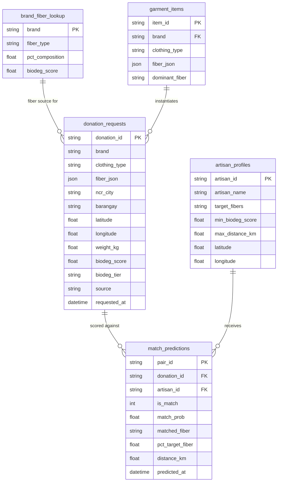

# WeaveForward: Fiber–Artisan Match Pipeline & Recommendation Model

**ML Repository:** [weaveforward_fiber_model](https://github.com/bakuncwa/weaveforward_fiber_model)

**Django API Integration:** Export-ready — model artifacts are copied to the WeaveForward Django API via the `DJANGO_ML_DIR` environment variable (see Section 8-E in the notebook).

---

## Project Description

**The WeaveForward Fiber-Artisan Match Pipeline & Recommendation Model** is a machine learning pipeline that predicts whether a garment donation request should be routed to a specific artisan business for upcycling. The model scores every (donor request, artisan) pair and outputs `is_match = 1` if the garment's fiber composition, biodegradability score, and geographic proximity all meet the artisan's material requirements.

The pipeline is designed to power the **WeaveForward Django API**, where artisan businesses in Metro Manila receive routed donation requests from the platform's donor-facing interface.

---

## Problem Statement

Textile waste in the Philippines remains largely unrecovered due to a lack of infrastructure connecting individual garment donors to artisan upcyclers who can actually use the material. Key friction points include:

- No automated way to assess whether a donated garment meets an artisan's fiber requirements
- Biodegradability standards are not applied to routing decisions
- Geographic proximity is not factored into donation logistics
- Manual matching is slow and does not scale

**Target Users:**
WeaveForward platform operators, artisan upcycling businesses (NCR), and individual garment donors.

---

## Solution

The pipeline solves garment-to-artisan matching by:

- Extracting per-fiber composition percentages from scraped brand catalog data
- Scoring each donated garment against each registered artisan's accepted fiber list, biodegradability minimum, and collection radius
- Training a binary CatBoost classifier (`is_match`) on the resulting pair matrix
- Exporting the trained model and metadata to the WeaveForward Django API

**Match Gates (all three must pass for `is_match = 1`):**

| Gate | Condition |
|---|---|
| Fiber share | `pct_target_fiber >= 85%` (biodegradability standard) |
| Biodegradability | `biodeg_score >= artisan.min_biodeg_score` |
| Proximity | `distance_km <= artisan.max_distance_km` |

---

## ETL Pipeline


---

## Data Sources

> **Important: Synthetic vs. Scraped Data**

| Data | Source | Status |
|---|---|---|
| Brand fiber lookup JSON | Derived from catalog — maps brand to known fiber composition | **Real scraped data** |
| Donor request records | Generated synthetically from the catalog with NCR geocoding via Nominatim OSM | **Synthetic — for pipeline testing** |
| Artisan business registry | 6 Metro Manila artisan profiles (names, coordinates, fiber preferences) | **Synthetic — for pipeline testing** |

The artisan registry in `cell 35` (Section 5-A-2) carries a prominent `SYNTHETIC DATA DISCLAIMER`. In production, this registry will be populated from the WeaveForward Django API's `artisan_profiles` database table (`/api/artisans/`).

---

## Machine Learning Model

- Built using **CatBoost Gradient Boosted Decision Trees (GBDT)**
- Task: **Binary classification** — `is_match` (1 = route donation to artisan, 0 = no match)
- Optimized via **Optuna** (30 trials, 3-fold stratified CV, maximize binary F1)

### Best Hyperparameters (Optuna)

| Parameter | Value |
|---|---|
| `iterations` | 611 |
| `depth` | 9 |
| `learning_rate` | 0.2256 |
| `l2_leaf_reg` | 8.816 |
| `bagging_temperature` | 0.446 |
| `border_count` | 159 |
| `loss_function` | Logloss |
| `eval_metric` | AUC |

### Evaluation Metrics (Test Set, threshold = 85%)

| Metric | Score |
|---|---|
| **Accuracy** | 97.67% |
| **F1 (binary)** | 95.24% |
| **F1 (macro)** | 96.85% |
| **Precision** | 100.00% |
| **Recall** | 90.91% |
| **ROC-AUC** | 1.0000 |

**Precision = 1.00** means the model made zero false routing decisions — every request it routed to an artisan was a confirmed match. **Recall = 0.91** means it correctly captured 10 of 11 true matches in the test set, missing 1.

### Dataset Summary

| Detail | Value |
|---|---|
| Donor requests (base) | 71 garments |
| Artisan businesses | 6 (synthetic, NCR) |
| Pair matrix | 426 rows (71 × 6) |
| Matches (`is_match=1`) | 54 (12.7%) — applying 85% threshold |
| No-match (`is_match=0`) | 372 (87.3%) |
| Train / Test split | 340 / 86 (stratified) |
| Total features | 30 |
| Categorical features | 11 |

### Features

**Fiber percentages (7):** `pct_alpaca`, `pct_cotton`, `pct_elastane`, `pct_nylon`, `pct_polyester`, `pct_tencel`, `pct_viscose`

**Match-signal numerics (5):** `pct_target_fiber`, `distance_km`, `biodeg_target_fiber`, `artisan_min_biodeg`, `artisan_max_dist_km`

**Standard numerics (7):** `pct_bio_lookup`, `fs_bio_share`, `biodeg_score`, `demand_index`, `weight_kg`, `latitude`, `longitude`

**Categoricals (11):** `brand`, `clothing_type`, `source`, `most_dominant_fiber`, `dominant_fiber_lookup`, `matched_fiber`, `biodeg_tier`, `ncr_city`, `barangay`, `artisan_id`, `artisan_target_fibers_str`

### Biodegradability Score Reference

| Fiber | Score | Bio-Degradable |
|---|---|---|
| hemp | 96 | Yes |
| linen | 95 | Yes |
| cotton | 92 | Yes |
| tencel / lyocell | 91 | Yes |
| silk | 83 | Yes |
| denim | 78 | Yes |
| wool / cashmere | 74 | Yes |
| bamboo / alpaca | 73 | Yes |
| modal / viscose / rayon | 72–76 | Yes |
| nylon | 12 | No |
| polyester | 8 | No |
| acrylic | 5 | No |
| elastane / spandex / lycra | 4 | No |

---

## Sample Model Output — Donor Requests Routed to Artisan Businesses (Test Set)

The table below shows confirmed model routes (TP) from the test set — donor requests the model predicted `is_match=1` and ground truth confirms. Columns ordered by CatBoost feature importance.

> All artisan business data is **synthetic**. Donor request data is **generated** from real scraped catalog records with simulated NCR coordinates.

```
== DONOR REQUESTS ROUTED TO ARTISAN BUSINESSES  (MODEL PREDICTIONS) =======
   Threshold: 85.0%  |  Test rows: 86  |  Model-routed requests: 11

-- Correctly routed (TP) — requests the model routes AND ground truth confirms

  Habi Weaves Ermita  (accepts: cotton,tencel)  <--  3 incoming request(s)
  Marikina Heritage Weavers  (accepts: alpaca,cotton)  <--  4 incoming request(s)
  Pasig Natural Threads  (accepts: viscose,cotton)  <--  3 incoming request(s)

  Columns shown: donation_id | brand | clothing_type | ncr_city | matched_fiber
                 pct_target_fiber | biodeg_score | distance_km | match_prob

-- Incorrectly routed (FP): 0  — model made no incorrect routing decisions
```

See **cell 55 (Section 8-D)** in the notebook to regenerate this report interactively after retraining.

---

## Visualizations

All plots are saved to `data/visualizations/`. Run Section 6 and Section 8 cells to regenerate.

### Section 4-E — Donor Request Distributions

**4E1 — Biodegradability Score KDE**


**4E2 — Donation Volume by NCR City**


**4E3 — Biodegradability Tier by Clothing Type**


**4E4 — Fiber KPI City Heatmap**


### Section 6 — EDA

**6A — Average Fiber Composition per NCR City (Stacked Area)**


**6B — Spearman Correlation Heatmap**


**6C — Top 20 Brands by Donation Volume**


**6D — Average Fiber Composition Across Donor Requests**


**6E — Donation Decisions per NCR City**


### Section 8 — Model Evaluation

**8B — Confusion Matrix + FP/FN Bar Chart**


**8C — Feature Importance + SHAP Summary (Match Class)**


---

## What to Run First

The notebook is fully sequential. Run cells top-to-bottom. Key dependencies:

```
Section 1–2   Imports + Spark session
Section 3      Brand fiber lookup JSON loading (_FIBERS_OF_INTEREST derivation)
Section 4      Donor request generation + NCR geocoding (Nominatim OSM)
                -- geocoding makes live HTTP requests; results are cached in 4-F
Section 5-A-2  Artisan registry (SYNTHETIC) + haversine distance function
Section 5-B-1  Base feature expansion (FIBER_MATCH_THRESHOLD = 85.0)
Section 5-B-2  Donation x artisan cross-join -> df_pairs
Section 5-B-3  is_match label computation
Section 5-C    Feature column definitions
Section 6      EDA visualizations (requires df_feat from 5-B-3)
Section 7-A    Train/test split
Section 7-B    Optuna hyperparameter search (30 trials -- takes ~5 min)
Section 7-C    Final model training with plot=True (live Logloss + AUC chart)
Section 8      Evaluation, confusion matrix, SHAP, routed request report
```

> If you change `FIBER_MATCH_THRESHOLD` in Section 5-B-1, re-run **5-B-1 through 7-A** before retraining.

---

## Project Structure

```
WeaveForward_FiberClassificationML/
├── data/
│   ├── processed/                    # Parquet output from Spark transforms
│   ├── raw/                          # Raw donor request CSVs (Spark source)
│   ├── spark_warehouse/              # Spark SQL warehouse
│   ├── visualizations/               # All saved PNG charts
│   └── webscraped_data/
│       └── webscraped_catalog.csv    # Scraped brand fiber catalog (real data)
├── models/
│   ├── catboost_fiber_match.cbm      # Trained CatBoost model binary
│   ├── fiber_match_metadata.json     # Feature columns, artisan registry, best params
│   └── fiber_match_eval_report_latest.json  # Latest evaluation metrics
├── notebooks/
│   ├── fiber_recommendation_model.ipynb    # Main ML pipeline notebook
│   └── webscraper_extraction.ipynb         # Brand catalog scraping notebook
├── .env                              # DJANGO_ML_DIR path for artifact export
├── .gitignore
└── README.md
```

---

## Database Schema / ERD

The ERD below reflects the logical data model used by the WeaveForward Django API. The pipeline's feature matrix is derived from these entities.



---

## Tech Stack

| Category | Technology / Library |
|---|---|
| **Backend / API** | Python, Django, Django REST Framework |
| **Machine Learning** | CatBoost, scikit-learn, Optuna, SHAP |
| **Data Processing** | pandas, NumPy, PySpark / Spark SQL |
| **Geospatial** | geopy (Nominatim OSM), haversine distance |
| **Data Scraping** | requests, BeautifulSoup, Selenium |
| **Visualization** | Matplotlib, Seaborn |
| **Storage** | Parquet (Spark), CSV, CatBoost `.cbm` binary |
| **Notebook** | Jupyter (VS Code), ipywidgets (live training chart) |
| **Hyperparameter Tuning** | Optuna (30 trials, 3-fold stratified CV) |

---

## Artisan Registry (Synthetic — Testing Only)

> All 6 artisan profiles below are **fabricated for pipeline development**. They do not represent real businesses. In production, replace with a live call to `/api/artisans/`.

| ID | Artisan Name | Accepted Fibers | Min Biodeg | Max Radius |
|---|---|---|---|---|
| art-001 | Habi Weaves Ermita | cotton, tencel | 60 | 12.0 km |
| art-002 | Diliman Fiber Collective | tencel, viscose | 70 | 18.0 km |
| art-003 | Makati Upcycle Studio | cotton, viscose, tencel | 55 | 10.0 km |
| art-004 | Pasig Natural Threads | viscose, cotton | 50 | 15.0 km |
| art-005 | Marikina Heritage Weavers | alpaca, cotton | 65 | 20.0 km |
| art-006 | Taguig EcoFabric Lab | nylon, polyester | 30 | 14.0 km |

---

## Key Takeaways

- A fiber match threshold of **85%** enforces biodegradability standards and meaningfully reduces the match pool (from 26% to 12.7% of pairs), ensuring artisans only receive suitable materials.
- **Precision = 1.00** on the test set confirms the model makes no incorrect routing decisions — artisans are never sent garments that fail their criteria.
- The closest misses (FP = 0, test set) were all distance failures on garments with 100% target fiber — indicating the proximity gate is the binding constraint in this synthetic dataset.
- PySpark feature engineering scales the pair-matrix construction to production-size donor and artisan tables without refactoring.
- The pipeline is fully export-ready: `catboost_fiber_match.cbm` + `fiber_match_metadata.json` are copied to the Django API at the end of Section 8.

---

## Roles & Responsibilities

### Technical Contributions

- Built an automated ETL pipeline web-scraping brand fiber composition data from fashion retailers using custom scrapers (`scraper.py`), producing `webscraped_catalog.csv` — the real-data source for all downstream fiber feature engineering.
- Engineered 30 features via PySpark / Spark SQL — implemented `expand_fibers()` UDF to extract per-fiber percentage columns (`pct_alpaca`, `pct_cotton`, `pct_elastane`, `pct_nylon`, `pct_polyester`, `pct_tencel`, `pct_viscose`) from raw JSON fiber composition; computed `pct_target_fiber`, `biodeg_target_fiber`, and `biodeg_score` per pair; added `clip(upper=100.0)` guard to handle malformed fiber JSON values exceeding 100%.
- Constructed a donation × artisan cross-join pair matrix (71 donors × 6 artisans = 426 rows) and computed binary `is_match` labels using three-gate logic: fiber share ≥ 85%, biodegradability score ≥ artisan minimum, and haversine distance ≤ artisan collection radius.
- Geocoded 71 synthetic donor request records across NCR barangays using Nominatim OSM (live HTTP, cached via 4-F Spark persist) and implemented haversine distance computation for each donor–artisan pair.
- Optimized a CatBoost GBDT binary classifier (`is_match`) via Optuna (30 trials, 3-fold stratified CV, maximize binary F1) — best params: iterations=611, depth=9, lr=0.2256, l2_leaf_reg=8.816; achieved 97.67% accuracy, 95.24% F1-binary, 100.00% precision, 90.91% recall, and 1.0000 ROC-AUC on the 86-row stratified test set.
- Produced a normalized confusion matrix and FP/FN bar chart confirming zero false routing decisions (Precision = 1.00) — 10/11 true matches correctly captured, with the single FN being a distance failure on a 100% target-fiber garment.
- Generated 11 diagnostic visualizations including KDE of biodegradability scores, donation volume by NCR city, fiber KPI heatmaps, a Spearman correlation heatmap across fiber percentages and biodeg/demand features, brand distribution, and a SHAP summary plot identifying `pct_target_fiber`, `distance_km`, and `biodeg_target_fiber` as the primary `is_match` drivers.
- Exported the trained model artifacts (`catboost_fiber_match.cbm`, `fiber_match_metadata.json`, `fiber_match_eval_report_latest.json`) to the WeaveForward Django API via `DJANGO_ML_DIR` environment variable for live inference at `/api/match-predict/`.

---

## References

1. **Ellen MacArthur Foundation (2017). A New Textiles Economy: Redesigning Fashion's Future.**
   [https://ellenmacarthurfoundation.org/a-new-textiles-economy](https://ellenmacarthurfoundation.org/a-new-textiles-economy)
2. **UNEP (2019). UN Alliance for Sustainable Fashion.**
   [https://unfashionalliance.org](https://unfashionalliance.org)
3. **Nominatim / OpenStreetMap — NCR Geocoding** *(used in Section 4 donor geocoding)*
   [https://nominatim.openstreetmap.org](https://nominatim.openstreetmap.org)
4. **CatBoost — Gradient Boosted Decision Trees**
   [https://catboost.ai](https://catboost.ai)
5. **Optuna — Hyperparameter Optimization Framework**
   [https://optuna.org](https://optuna.org)
6. **SHAP — SHapley Additive exPlanations**
   [https://shap.readthedocs.io](https://shap.readthedocs.io)
